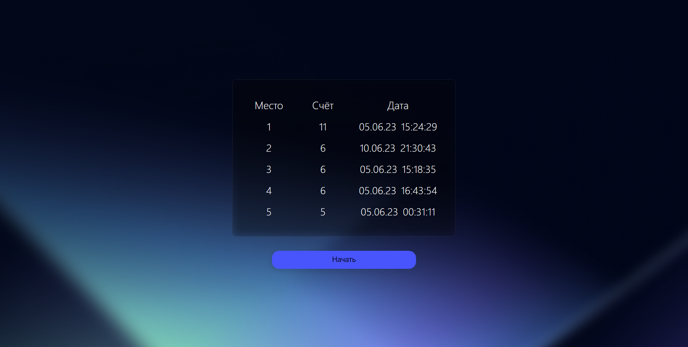
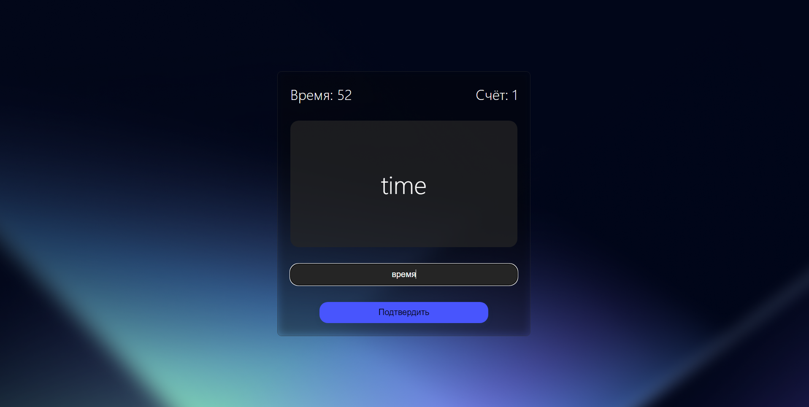

# English Training App

This is a web application for testing your English language skills. The user has to translate as many words as possible within one minute. The app retrieves a list of English words  and displays them one by one to the user for translation.

## Installation and Usage

To run the app locally, follow these steps:

1. Clone the repository to your local machine.
2. Navigate to the project directory.
3. Run `npm install` to install the dependencies.
4. Run `npm start` to start the development server.
5. Open your browser and go to http://localhost:3000.

## Technologies and Libraries Used

This app was built using React.js and styled with CSS modules. It also uses React Context and local storage for storing the user's results.

## Features

The main features of this app are:

WordService.jsx:
- Retrieving a list of English words and their translations from an external API.

WordExercise.jsx:
- Starting a one-minute timer for the user to translate as many words as possible.
- Displaying a card with an English word and a text input for the user to enter its translation.
- Checking the user's answer and awarding or deducting points accordingly.

ScoreList.jsx:
- Displaying the final score and highlighting it in the leaderboard if it's in the top 5.

## Design of application

